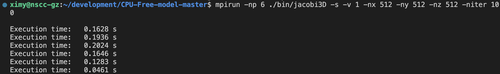
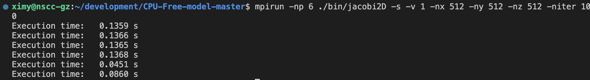
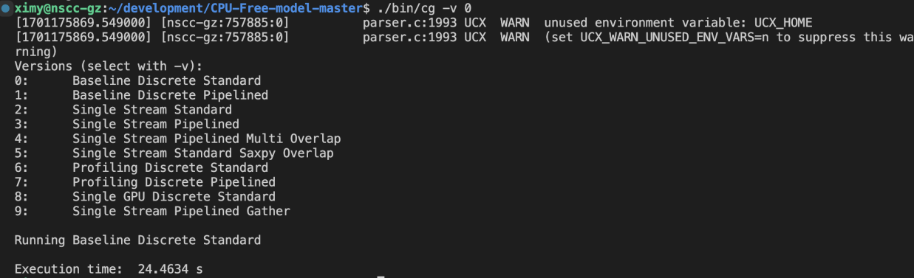
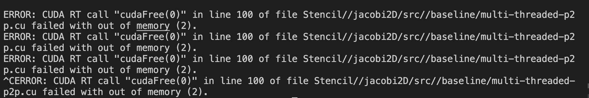
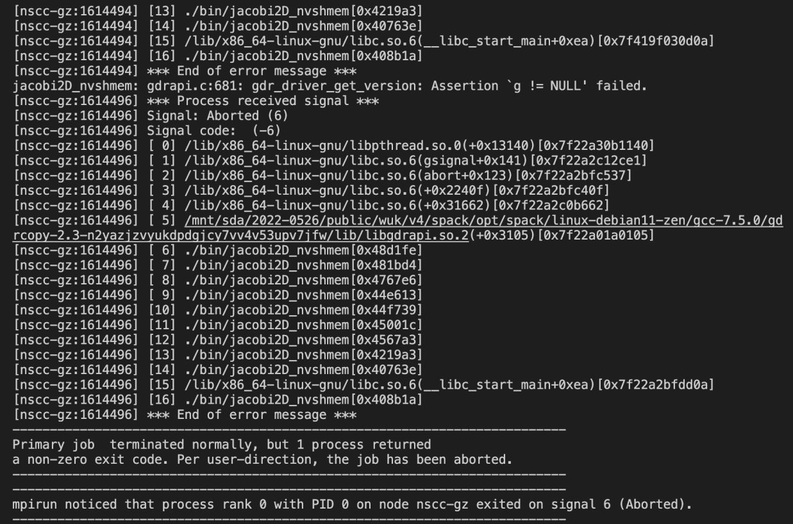

本项目基于https://github.com/ParCoreLab/CPU-Free-model
在该项目的基础上，做了实验复现，实现调试，实验优化。
# 实验进展记录
## 配置环境
1、安装NVSHMEM
安装spack，git下来，之后装进bashrc就好了

```
spack install nvshmem +gpu_initiated_support +cuda +gdrcopy +ucx +mpi ^openmpi +cuda@11.4.0 fabrics=ucx ^ucx +cuda +gdrcopy +dm +thread_multiple
```

2、安装gcc：

```curl -O ftp://ftp.gnu.org/gnu/gcc/gcc-7.5.0/gcc-7.5.0.tar.gz
./configure --prefix=/mnt/sda/2022-0526/home/ximy/env/gcc
缺依赖：configure: error: Building GCC requires GMP 4.2+, MPFR 2.4.0+ and MPC 0.8.0+.
```

需要重新安装gcc7.5.0 

3、配置相关环境变量：
spack load所做的事情：就是把特定包的目录添加到你的环境变量中

```
export NVSHMEM_HOME=/mnt/sda/2022-0526/public/wuk/v4/spack/opt/spack/linux-debian11-zen/gcc-7.5.0/nvshmem-2.7.0-6-pqzqlbuoamnxcug4ydrctmxzafabvx6e
export MPI_HOME=/mnt/sda/2022-0526/public/wuk/v4/spack/opt/spack/linux-debian11-zen/gcc-7.5.0/openmpi-4.1.6-yfs4tvyt5bu2cs3gpobwh257jcugsq7a
export CUDA_HOME=/mnt/sda/2022-0526/public/wuk/v4/spack/opt/spack/linux-debian11-zen/gcc-7.5.0/cuda-11.8.0-tqrjbbnbbbbwtvpdrhib2drpnvyqfynw 
export UCX_HOME=/mnt/sda/2022-0526/public/wuk/v4/spack/opt/spack/linux-debian11-zen/gcc-7.5.0/ucx-1.14.1-oeveoehh7b27qdcfrpmghrvlj22l4223
export LD_LIBRARY_PATH="$NVSHMEM_HOME/lib:$UCX_HOME/lib:$CUDA_HOME/lib64:$MPI_HOME/lib:$LD_LIBRARY_PATH"
spack load mpi
spack load bc
```
4、编译：
```
make -f Makefile2 all   make -f Makefile2 stencil
```
## 实验调试

见提交作业文档的“实验调试”部分
运行示例效果如下:






## 实验优化
见提交作业文档的“实验优化”部分
通过下述命令可以简单控制NUMA节点

```
CUDA_VISIBLE_DEVICES=4,5
```
查看运行情况
```
nvidia-smi
```
## 实验结果

| 2D-弱缩放版本，GPU数量 | 命令                                                         | 1      |                                                              | 2      |                                                              | 4      |                                                              | 6      |
| ---------------------- | ------------------------------------------------------------ | ------ | ------------------------------------------------------------ | ------ | ------------------------------------------------------------ | ------ | ------------------------------------------------------------ | ------ |
| Baseline Copy          | mpirun -np 1 ./bin/jacobi2D -v 0 -nx 256 -ny 256 -niter 5000 | 0.7821 | mpirun -np 2 ./bin/jacobi2D -v 0 -nx 256 -ny 512 -niter 5000 | 8.9152 | mpirun -np 4 ./bin/jacobi2D -v 0 -nx 512 -ny 512 -niter 5000 | 3.4053 | mpirun -np 6 ./bin/jacobi2D -v 0 -nx 512 -ny 1024 -niter 5000 | 2.4117 |
| Baseline Overlap       | mpirun -np 1 ./bin/jacobi2D -v 1 -nx 256 -ny 256 -niter 5000 | 0.8998 | mpirun -np 2 ./bin/jacobi2D -v 1 -nx 256 -ny 512 -niter 5000 | 3.1967 | mpirun -np 4 ./bin/jacobi2D -v 1 -nx 512 -ny 512 -niter 5000 | 5.1092 | mpirun -np 6 ./bin/jacobi2D -v 1 -nx 512 -ny 1024 -niter 5000 | 6.1425 |
| Baseline P2P           | mpirun -np 1 ./bin/jacobi2D -v 2 -nx 256 -ny 256 -niter 5000 | 1.1998 | mpirun -np 2 ./bin/jacobi2D -v 2 -nx 256 -ny 512 -niter 5000 | 3.0560 | mpirun -np 4 ./bin/jacobi2D -v 2 -nx 512 -ny 512 -niter 5000 | 3.2321 | mpirun -np 6 ./bin/jacobi2D -v 2 -nx 512 -ny 1024 -niter 5000 | 5.6214 |
| Baseline NVSHMEM       | mpirun -np 1 ./bin/jacobi2D_nvshmem -v 0 -nx 256 -ny 256 -niter 5000 | 0.0542 | mpirun -np 2 ./bin/jacobi2D_nvshmem -v 0 -nx 256 -ny 512 -niter 5000 | 2.1021 | mpirun -np 4 ./bin/jacobi2D_nvshmem -v 0 -nx 512 -ny 512 -niter 5000 | 3.5721 | mpirun -np 6 ./bin/jacobi2D_nvshmem -v 0 -nx 512 -ny 1024 -niter 5000 | 5.2307 |
| CPU-Free               | Design X Partitionedmpirun -np 1 ./bin/jacobi2D_nvshmem -v 2 -nx 256 -ny 256 -niter 5000 | 0.0708 | mpirun -np 2 ./bin/jacobi2D_nvshmem -v 2 -nx 256 -ny 512 -niter 5000 | 1.2305 | mpirun -np 4 ./bin/jacobi2D_nvshmem -v 2 -nx 512 -ny 512 -niter 5000 | 2.0129 | mpirun -np 6 ./bin/jacobi2D_nvshmem -v 2 -nx 512 -ny 1024 -niter 5000 | 5.0369 |

| 2D-强缩放版本，GPU数量 |                                                              | 1      |                                                              | 2      |                                                              | 4      |                                                              | 6      |
| ---------------------- | ------------------------------------------------------------ | ------ | ------------------------------------------------------------ | ------ | ------------------------------------------------------------ | ------ | ------------------------------------------------------------ | ------ |
| Baseline Copy          | mpirun -np 1 ./bin/jacobi2D -v 0 -nx 512 -ny 512 -niter 5000 | 1.9696 | mpirun -np 2 ./bin/jacobi2D -v 0 -nx 512 -ny 512 -niter 5000 | 3.1364 | mpirun -np 4 ./bin/jacobi2D -v 0 -nx 512 -ny 512 -niter 5000 | 4.4655 | mpirun -np 6 ./bin/jacobi2D -v 0 -nx 512 -ny 512 -niter 5000 | 4.2687 |
| Baseline Overlap       | mpirun -np 1    ./bin/jacobi2D -v 1 -nx 512 -ny 512 -niter 5000 | 2.6802 | mpirun -np  2 ./bin/jacobi2D -v 1 -nx 512 -ny 512 -niter 5000 | 5.1402 | mpirun -np 4 ./bin/jacobi2D -v 1 -nx 512 -ny 512 -niter 5000 | 4.3091 | mpirun -np 6 ./bin/jacobi2D -v 1 -nx 512 -ny 512 -niter 5000 | 4.5891 |
| Baseline P2P           | mpirun -np 1 ./bin/jacobi2D -v 2 -nx 512 -ny 512 -niter 5000 | 2.1076 | mpirun -np 2 ./bin/jacobi2D -v 2 -nx 512 -ny 512 -niter 5000 | 2.7719 | mpirun -np 4 ./bin/jacobi2D -v 2 -nx 512 -ny 512 -niter 5000 | 3.2296 | mpirun -np 6 ./bin/jacobi2D -v 2 -nx 512 -ny 512 -niter 5000 | 3.0771 |
| Baseline NVSHMEM       | mpirun -np 1 ./bin/jacobi2D_nvshmem -v 0 -nx 512 -ny 512 -niter 5000 | 3.4897 |                                                              | 3.2561 | mpirun -np 4 ./bin/jacobi2D_nvshmem -v 0 -nx 512 -ny 512 -niter 5000 | 3.1479 |                                                              | 3.0197 |
| CPU-Free               | mpirun -np 1 ./bin/jacobi2D_nvshmem -v 2 -nx 512 -ny 512 -niter 5000 | 2.0521 |                                                              | 2.1428 | mpirun -np 4 ./bin/jacobi2D_nvshmem -v 2 -nx 512 -ny 512 -niter 5000 | 2.0541 |                                                              | 2.1693 |

| 3D-强缩放版本，GPU数量     | 命令                                                         | 1      |                                                              | 2      |                                                              | 4      |                                                              | 6      |
| -------------------------- | ------------------------------------------------------------ | ------ | ------------------------------------------------------------ | ------ | ------------------------------------------------------------ | ------ | ------------------------------------------------------------ | ------ |
| Baseline Copy              | mpirun -np 1 ./bin/jacobi3D -v 0 -nx 256 -ny 256 -nz 256 -niter 5000 | 6.3457 | mpirun -np 2 ./bin/jacobi3D -v 0 -nx 256 -ny 256 -nz 256 -niter 5000 | 3.5112 | mpirun -np 4 ./bin/jacobi3D -v 0 -nx 256 -ny 256 -nz 256 -niter 5000 | 4.5635 | mpirun -np 6 ./bin/jacobi3D -v 0 -nx 256 -ny 256 -nz 256 -niter 5000 | 7.4365 |
| Baseline Overlap           | mpirun -np 1 ./bin/jacobi3D -v 1 -nx 512 -ny 512 -nz 512 -niter 5000 | 5.6122 | mpirun -np 2 ./bin/jacobi3D -v 1 -nx 256 -ny 256 -nz 256 -niter 5000 | 5.6910 | mpirun -np 4 ./bin/jacobi3D -v 1 -nx 256 -ny 256 -nz 256 -niter 5000 | 4.7865 | mpirun -np 6 ./bin/jacobi2D -v 1 -nx 512 -ny 1024 -niter 5000 | 6.3942 |
| Baseline P2P               | mpirun -np 1 ./bin/jacobi3D -v 2 -nx 512 -ny 512 -nz 512 -niter 5000 | 6.3777 | mpirun -np 2 ./bin/jacobi3D -v 2 -nx 256 -ny 256 -nz 256 -niter 5000 | 4.1774 | mpirun -np 4 ./bin/jacobi2D -v 2 -nx 512 -ny 512 -niter 5000 | 3.9765 | mpirun -np 6 ./bin/jacobi2D -v 2 -nx 512 -ny 1024 -niter 5000 | 8.4252 |
| Baseline NVSHMEM  CPU-FREE | mpirun -np 1 ./bin/jacobi3D_nvshmem -v 0 -nx 512 -ny 512 -nz 512 -niter 5000  mpirun -np 1 ./bin/jacobi3D -v 4 -nx 256 -ny 256 -nz 256 -niter 5000 | 4.6855 | mpirun -np 2 ./bin/jacobi3D -v 4 -nx 256 -ny 256 -nz 256 -niter 5000 | 3.7965 | mpirun -np 4 ./bin/jacobi2D_nvshmem -v 0 -nx 512 -ny 512 -niter 5000 | 2.3468 | mpirun -np 6 ./bin/jacobi2D_nvshmem -v 0 -nx 512 -ny 1024 -niter 5000 | 4.2953 |
| CPU-Free                   | Design X Partitionedmpirun -np 1 ./bin/jacobi3D_nvshmem -v 2 -nx 256 -ny 256 -nz 512 -niter 5000 | 4.2514 | mpirun -np 2 ./bin/jacobi2D_nvshmem -v 2 -nx 256 -ny 512 -niter 5000 | 3.5879 | mpirun -np 4 ./bin/jacobi2D_nvshmem -v 2 -nx 512 -ny 512 -niter 5000 | 2.1542 | mpirun -np 6 ./bin/jacobi2D_nvshmem -v 2 -nx 512 -ny 1024 -niter 5000 | 5.2142 |

| CG 默认矩阵          | 6个GPU  |
| -------------------- | ------- |
| CPU-Controlled标准CG | 24.4634 |
| CPU-Controlled流水CG | 20.0344 |
| CPU-Free标准CG       | 21.5624 |
| CPU-Free流水CG       | 18.2529 |

## 其他

跑的时候服务器会卡，就不会出结果，得重进以下；或者超出memory大小的情况，得进行相应的调整


